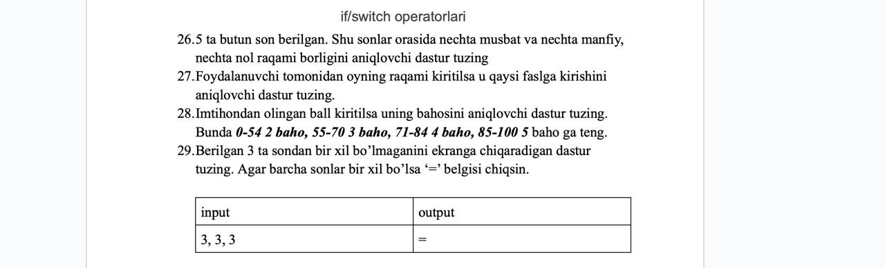

# Algoritms

1. 5 ta butun son berilgan. Shu sonlar orasida nechta musbat va nechta manfiy, nechta nol raqami borligini aniqlovchi dastur tuzilgan.
2. User tomonidan oyning raqami kiritilsa u qaysi faslga kirishini aniqlochi dastur tuzilgan.
3. Imtihondan olingan ball kiritilsa uning bahosini aniqlovchi dastur tuzilgan. Bunda 0-54 2 baho, 55-70 3 baho, 71-84 4 baho, 85-100 5 baho ga teng.
4. Berilgan 3 ta sondan bir xil bo'lmaganini ekranga chiqaradigan dastur tuzilgan. Agar barcha sonlar bir xil bo'lsa '==' belgisi chiqadi.
